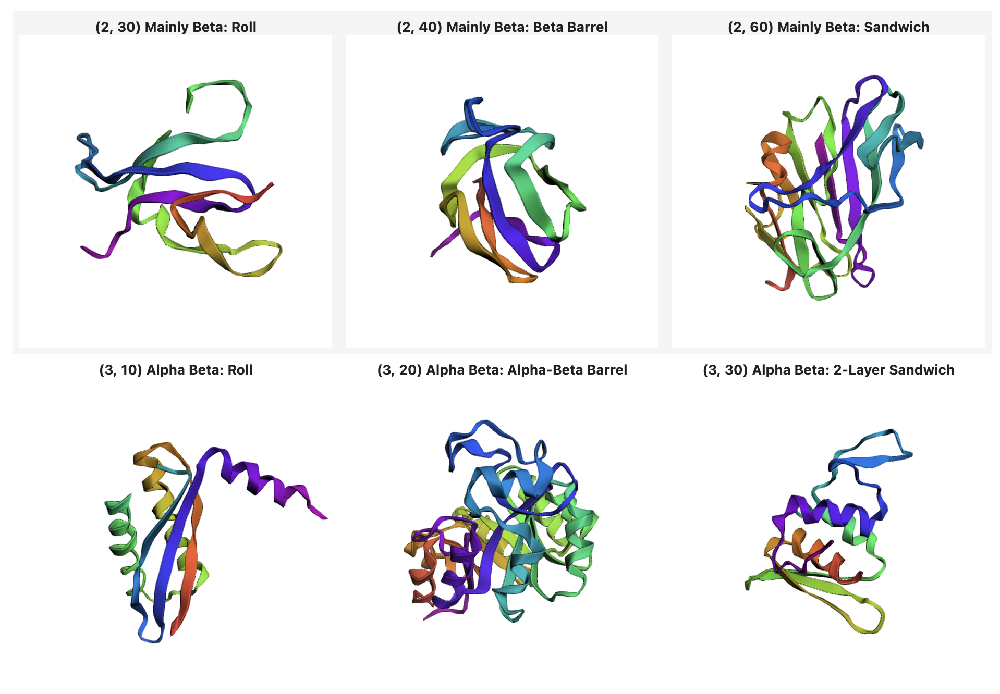

# Protein Structure Classifier

Custom protein structure classification, based using `PDB` (Protein Data Bank) and `CATH` (Class, Architecture, Topology, and Homologous superfamily) data. 
The core task is predicting the `protein architecture` based on its `amino acid sequence` and `3D structure`.



## Description

This project develops a ML model to categorize protein structures into predefined architectural classes. The model utilizes a Protein Structure Transformer architecture to leverage both the sequence and structural information of the protein to make accurate predictions.

The input data for the model consists of `protein sequences` and corresponding `3D structural information` (coordinates from `PDB` files). 

The structural data preprocessed into a format suitable for the Protein Structure Transformer (feature vectors describing secondary structure elements). 
`CATH` data is used as a ground truth reference for labeling and validating the architectural classification.

```python
architecture_names = {(1, 10): "Mainly Alpha: Orthogonal Bundle",
                      (1, 20): "Mainly Alpha: Up-down Bundle",
                      (2, 30): "Mainly Beta: Roll",
                      (2, 40): "Mainly Beta: Beta Barrel",
                      (2, 60): "Mainly Beta: Sandwich",
                      (3, 10): "Alpha Beta: Roll",
                      (3, 20): "Alpha Beta: Alpha-Beta Barrel",
                      (3, 30): "Alpha Beta: 2-Layer Sandwich",
                      (3, 40): "Alpha Beta: 3-Layer(aba) Sandwich",
                      (3, 90): "Alpha Beta: Alpha-Beta Complex"}
```

This dictionary indicates the hierarchical classification of protein architectures based on a combination of secondary structure elements (alpha-helices and beta-sheets) and overall fold patterns (e.g., bundles, barrels, sandwiches). 

The numerical keys within the dictionary represent specific criteria for defining the architectural types (e.g., ratios of alpha-helices, arrangement of beta-sheets).


## How to run

(Coming soon)